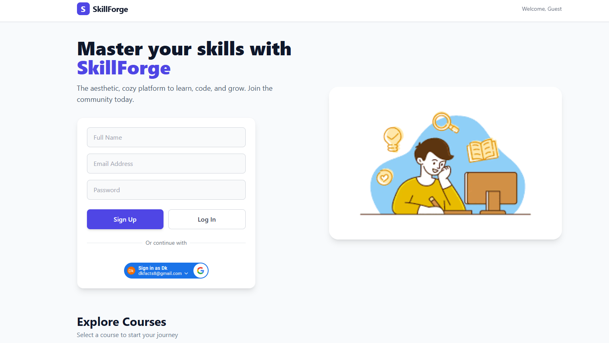
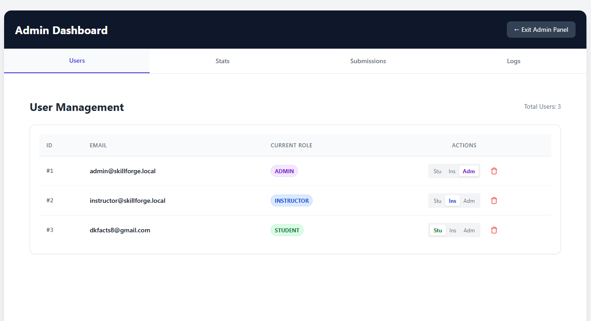
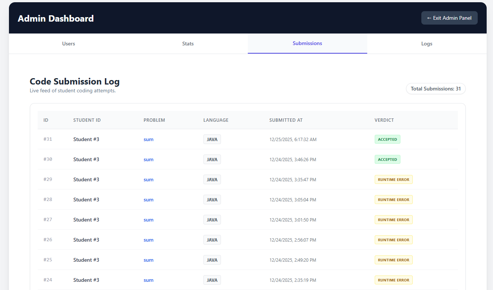
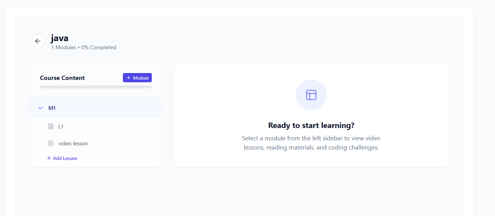
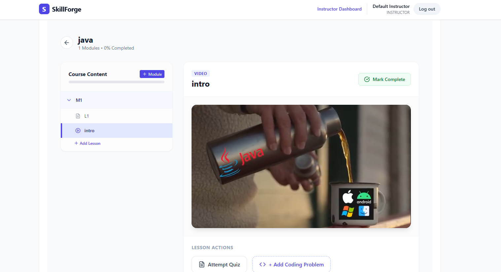
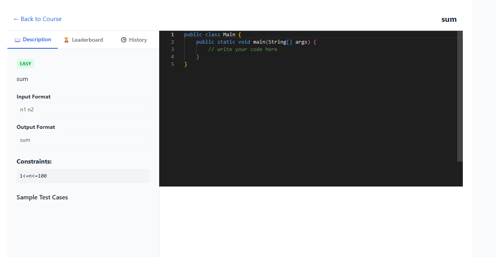
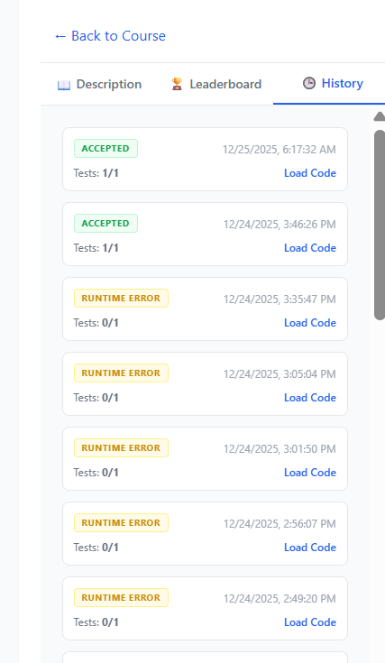
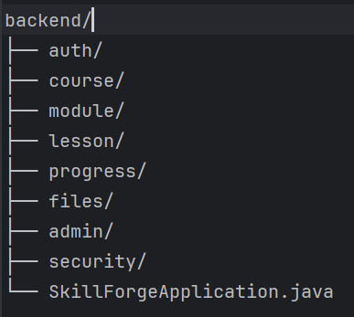
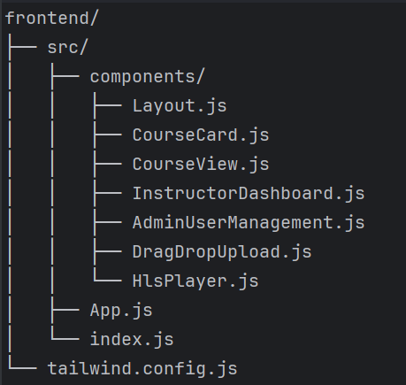

🚀 SkillForge – Online Learning Management System (LMS)

live at: https://skillforge-1-nws0.onrender.com

Screenshots:

Admin dashboard:

Instructor course creation and management:

Quizes creation

Student code submition

Submittion history

SkillForge is a production-style Learning Management System (LMS) inspired by platforms like Udemy and Coursera, built using Java Spring Boot and React.
It supports role-based dashboards, course creation, video & file uploads, lesson progress tracking, and admin management, all wrapped in a modern UI.

This project demonstrates real-world full-stack engineering, not just CRUD operations.

✨ Key Features
🔐 Authentication & Authorization

-JWT-based authentication

-Role-based access control:

-STUDENT

-INSTRUCTOR

-ADMIN

-Secure API access with Spring Security

**📚 Course Management**

**Instructors can:**

-Create courses

-Add modules & lessons

-Upload thumbnails, PDFs, and videos

Students can:->

-Browse courses

-Enroll in courses

-Access enrolled content only

**🧱 Module & Lesson System**

-Courses → Modules → Lessons hierarchy

Lessons support:-)

-Video lectures

-PDF resources

Clean separation of content structure

**▶️ Video & File Uploads**

Instructor-only uploads:

Course thumbnails

Lesson PDFs

Video lectures

**Storage:**

Local storage (development)

AWS S3 (production-ready)

**Video playback:**

MP4 streaming

HLS (m3u8) support

Background video processing using FFmpeg

**📈 Student Progress Tracking**

Manual “Mark as Completed” per lesson

Real-time course progress calculation

Progress bar UI for students

**👨‍🏫 Instructor Dashboard**

Overview statistics:

-Total courses

-Total students enrolled

-Total lessons

-Manage modules, lessons, and uploads

Clean, modern dashboard UI

**🛡️ Admin Dashboard**

View all users

Promote users:-)

Student → Instructor

Instructor → Admin

Enrollment statistics

Submission & system logs (scaffolded)

**🎨 Modern Frontend UI**

Built with React + Tailwind CSS

Sidebar-based layout

Card-based dashboards

Responsive design

Clean, professional SaaS-style UI

**🏗️ Tech Stack
Backend**

Java 17

Spring Boot

Spring Security (JWT)

Spring Data JPA

PostgreSQL

AWS S3

Docker

Frontend

React

Tailwind CSS

JavaScript (ES6+)

HLS.js (for video streaming)

DevOps / Cloud

Docker

AWS S3

Render 

📂 Project Structure

**Backend**

**Frontend**

**🧪 API Overview
Authentication**

POST /auth/signup

POST /auth/login

**Courses**

POST /courses (Instructor)

GET /courses

POST /courses/{id}/enroll

**Modules & Lessons**

POST /modules

POST /lessons

**Progress Tracking**

POST /progress/lesson/{lessonId}/complete

GET /progress/course/{courseId}

**File Uploads**

POST /api/files/upload

GET /api/files/view/{folder}/{filename}

**Admin**

GET /api/admin/users

PUT /api/admin/users/{id}/role

⚙**️ Local Setup**

Backend

``cd backend``
``mvn clean install``
``mvn spring-boot:run``

Frontend

``cd frontend``
``npm install``
``npm start``

**File & Video Storage: AWS S3

Video Streaming: S3 + HLS**

⚠️ Local file storage is used only for development.
Production uses AWS S3 for persistent storage.

🏆 Why This Project Is Strong

✔ Not a CRUD app

✔ Real SaaS-style architecture

✔ Role-based dashboards

✔ Video streaming & uploads

✔ Cloud-ready deployment

✔ Clean UI + backend depth

**This project demonstrates:**

Full-stack system design

Backend security & architecture

Frontend UX thinking

Cloud & DevOps awareness

**📌 Future Enhancements**

Course completion certificates (PDF)

Course analytics & drop-off tracking

Payment integration

Dark mode

CI/CD with GitHub Actions

Microservices split

👤 Author

Dheeraj

Computer Science Engineer | Full-Stack Java Developer
AI & Cloud Enthusiast